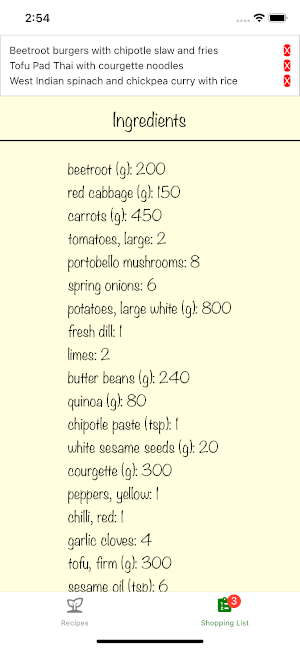

# Shopping List

A simple project to learn Redux Toolkit within React Native and Expo. 
       
The app allows a user to search by ingredient and return a list of recipes that contain the ingredient. Meals can be added to a shopping list and a second screen will list all necessary ingredients combined and their quantities.    

## Run

The easiest way to see this app in action is by downloading Expo to your mobile device and scanning in the QR code [here](https://expo.io/@pennywise/projects/ingredients).

## Features

* The search function is case insensitive and will return partial matches - typing 'ing' will return meals containing ingredients 'spring onions', 'ginger' etc.
* Meals can only be added to the shopping list once and an alert will show if attempted to add twice.
* Naigation is via the bottom tab bar and can easily switch between the list of recipes and the shopping list. The shopping list icon badge shows how many meals have been added.
* When a meal is added, common ingredients are added together within the shopping list.
* Meals can be removed on the shopping list screen and the ingredients list updates accordingly.
* App is locked in portrait mode.

## Redux Toolkit

State was orginally passed between screens via props, however when attempting to also pass functions between screens I decided that functionality would be improved via the use of Redux.  RTK was chosen for ease of setup.    
Two states are stored - an array of meal objects added and an object of ingredient keys and values. The reducer actions for these states are all contained within the shppingListSlice.    
When the current state is needed to populate lists or update the badge count, useSelector hook is called. When state is altered, for instance when adding or removing meals, useDispatch hooks are called. Once the redux store has been set up, it is much easier and cleaner for state management than passing around props between screens.

## Other dependencies added

@react-navigation       
react-native-safe-area-context  
expo-screen-orientation  

## Testing

Jest    
jest-circus   
Detox       

## Future updates

It has only been simulated on iOS so far, so checks are needed for android compatability with fonts, icons and screen sizes.    
Modal views - click on a recipe thumbnail and see greater detail. List of ingredients, instructions, larger image.  
Ability to add new recipes? - currently hardcoded and manually typed into js file.     
Change styling of shopping list (add background image?) - especially list of meals at top. Remove button hard to press on smaller screens.    
Sort ingredient alphabetically?   
Add ability to adjust meals per person, increasing ingredient quantities if needed. 

